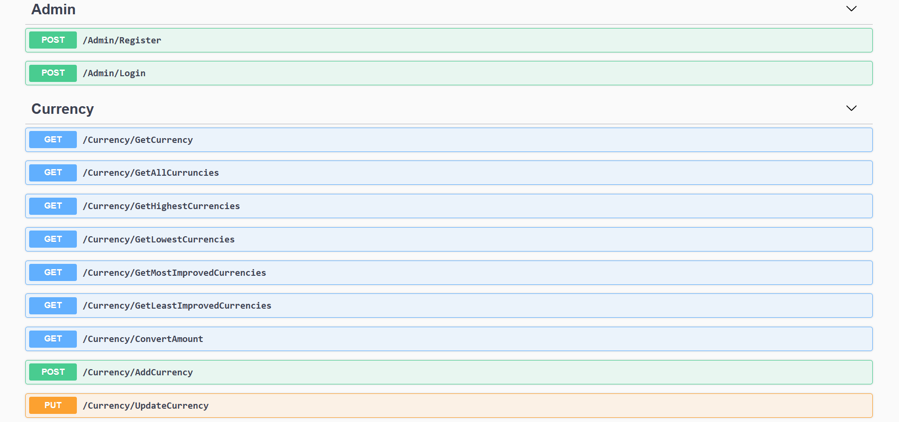

# Currency Converter
> It is Back End  Project about currencies domain  through providing many functions to deal 
  with converting from currency to another currency and track the highest and the lowest rate among currencies

## Table of Contents
* [General Info](#general-information)
* [Technologies Used](#technologies-used)
* [Features](#features)
* [Screenshots](#screenshots) 
* [Project Status](#project-status)

## General Information
- This project Based on Advanced Archicture ( Onion Architecture )
- Project based on Rest Api
- It contains 12 Api Functions
- Login and Register based on .NET Auth Model
- Samples of functions : AddCurrency , UpdateCurrency , DeleteCurrency , GetCurrencyByName
                         GetAllCurrencies , GetHighestNCurrencies , GetLowestNCurrencies , GetMostNImprovedCurrenciesByDate
                         GetLeastNImprovedCurrenciesByDate , Login , Register , ConvertAmount

## Technologies Used
- Back End -  C# , ASP.NET Core , SQl Server , Linq , Entity Framework

## Features
- Admin can add, edit and delete any currency.
- Admin can explore all currencies or specific one by its name.
- Admin can explore any count of the most highest or lowest rates of currencies.
- Admin can explore any count of the most or least improved rates within specified dates.
- Admin can register and login to use all the above mentioned services.
- All rates are measured in USD.
- Admin can convert any amount from specific currency to another currency.

## Screenshots

## Project Status
Project is: _complete_ 

